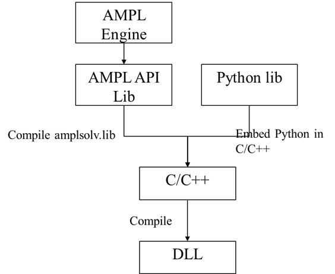
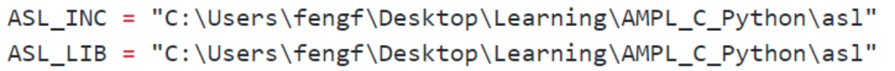

# AMPL_Python
A bridge between AMPL and Python allowing users to define external functions in Python and use those functions inside AMPL models. This is based on existing work by [PyOptimizer](https://github.com/PythonOptimizers/pyampl). Based on their work, the following modifications have been made;
  * Make it work on windows.
  * Because there is some problem with *Clang* on my computer, so I use *gcc* instead
    * To achieve this, I need to modify the `Makefile`
## Purpose & background
Because the official AMPL APIs to Python just allow us to transfer data with AMPL or to change the algebraic statements of the objectives and constraints. However, to the best of my knowledge, we are not allowed to use external **Python functions**  inside AMPL models. Thus, this work is devoted to bridge this gap. 

The whole flowchart are shown below.



**1)** Preparation

You need to have GCC or other compilers(e.g. Clang, MSVC) in your computer. For convenience, you could install Mingw, which is a collection of several compilers. You need to add it to you path to allow you run it from command line.
One important note is **if you are using 32-bit AMPL, you need to use 32-bit GCC or compile 32-bit DLL file. Also, you need to use 64 bit for 64-bit AMPL. Otherwise, you will get some errors because of compatibility issues**

**2)** `amplsolve.lib`

First, we need to compile an AMPL Solver library-`amplsolv.lib`. This library is necessary for C/C++ to communicate with AMPl.
**Step1.** Change your directory to folder-ASL
**Step2.** Run command
> make  // You might need to run Mingw32-make or you can make an alias for this.

**Step3.** The previous steps should create `amplsolv.lib`

**3)**`amplfunc.dll`

Then, compile `amplfunc.dll` without embedding **Python**.  The C file for this is **funcadd.c**.
Basically, the compilation of DLL files involves three steps: [**Pre-processing**,**compilation**, and **linking**](https://stackoverflow.com/questions/6264249/how-does-the-compilation-linking-process-work). Therefore, there are two issues that should gain significant attentions. That is, i) set correct include directories, where we could find all necessary `.h` files, and ii) correct lib directories, where we could find all required `lib` and `dll` files. 
Usually the compilation tasks are defined in a **Makefile** file. There are many good Makefile tutorials available(e.g. [1](https://opensource.com/article/18/8/what-how-makefile)), and necessary knowledge about Makefile could be easily gained by reading these tutorials. Therefore, both the include directories and lib directories are provided in Makefile, as below. These are the directories in my computer and should be modified accordingly. 



After this, run **make**to compile **amplfunc.dll**.
If nothing goes wrong, we will get this dll file. Now we can load it in AMPL to see if it works. The test script is shown below.

	load amplfunc.dll;
	function ginv;
	
	param p1;
	let p1 := ginv(10);
	display p1;

Again, if nothing goes wrong, AMPL will display
	>p1=0.1
	
**3)** `amplfunc.dll` with Python embedded
Now, we could embed Python to make Python functions accessible to AMPL. 
Reference [manual](https://docs.python.org/2/extending/embedding.html) are available on Python's official website. There are mainly two ways to embed python in C: very high level embedding, and pure embedding. Through the official tutorials we could implement this by ourselves. 
Now, we could add one more function in **function.c** which will call Python function in turn. Then, we have get our **function.c** version 2, which is also the **function.c** given in this repository. 
Then, we could move forward to compile **amplfunc.dll**. In addition, we need to add Python to our include directories and lib directories. 
After this, run **make**, and we will get a new **amplfunc.dll.** The following AMPL test script is used test if it works.

	load amplfunc.dll;
	function Py_log;
	param p1;
	let p1:=Py_log(1);
	display p1;

If nothing goes wrong, we will get
>p1=0;

#### Q&A
**1.** Different from compiling an executable program, compiling an DLL file requires us to provide an argument--:**-shared** to gcc command.

**2.** Because amplsolv.lib has redefined some C functions, like "printf". Therefore, we need to put **Python.h** before **funcadd.h** as below. Otherwise, we will get some errors.
```cpp
#include "Python.h"
#include "asl/funcadd.h"
```
**3.**  No module named site on Windows
Actually, I has not figured out the cause of this problem. However, I found a feasible solution that is putting the statement--**Py_NoSiteFlag** before initializing Python interpreter as below. 
```cpp
	Py_NoSiteFlag = 1;
	//Initialize python interpreter
	Py_Initialize();
```
**4.** There might be some deprecated Python functions or statements like **PyUnicode_fromDouble**, and this could be simply fixed by using **PyString_fromDouble**.

